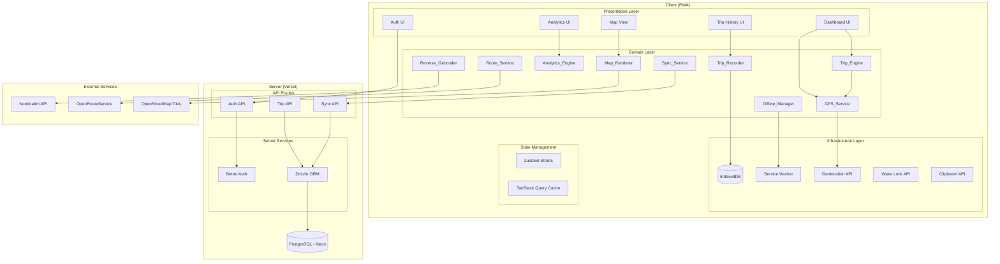
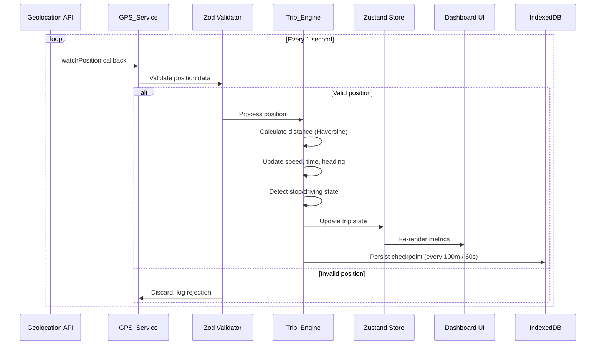
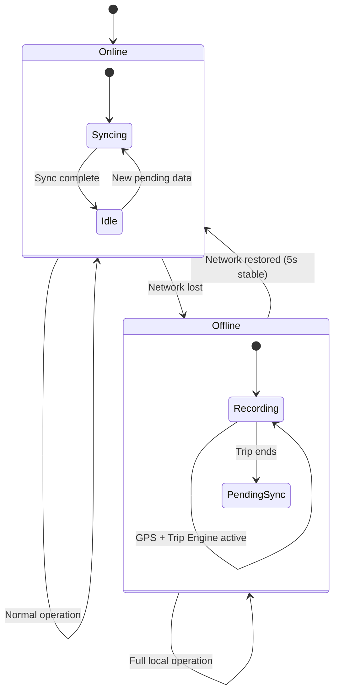
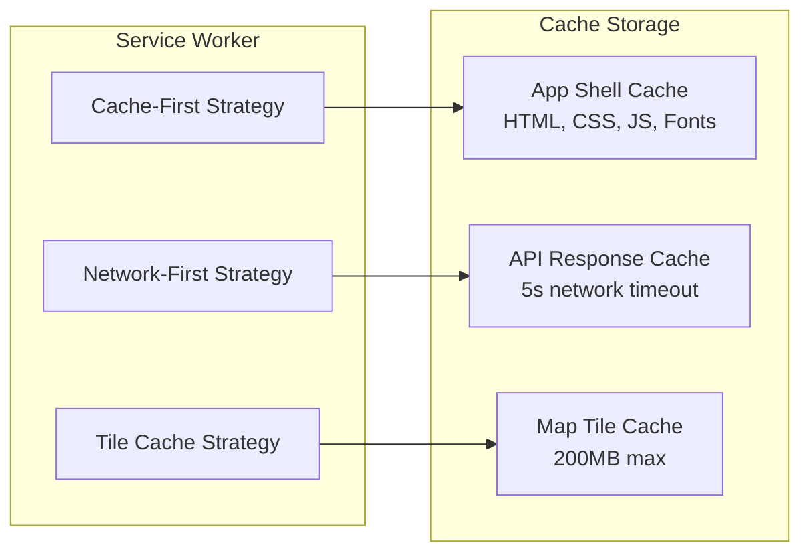
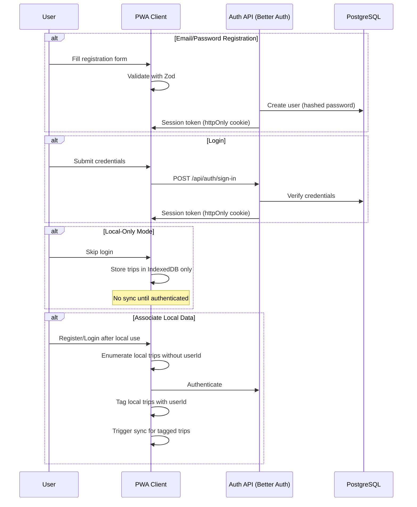
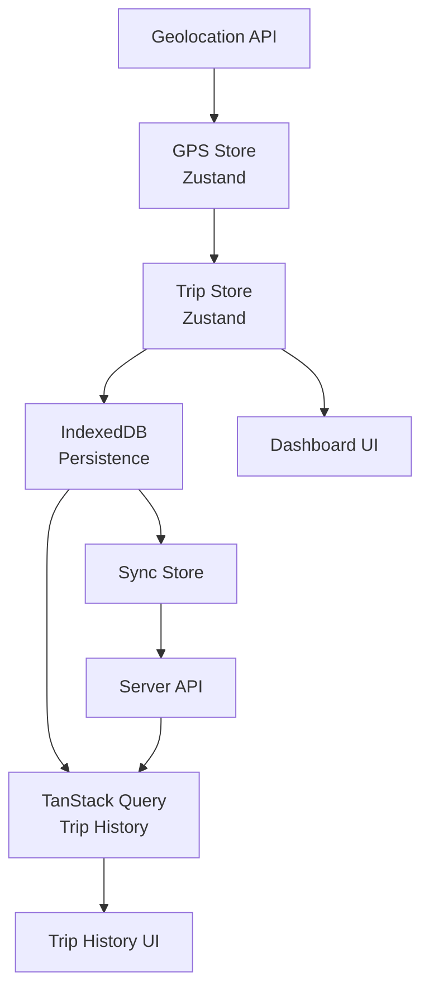
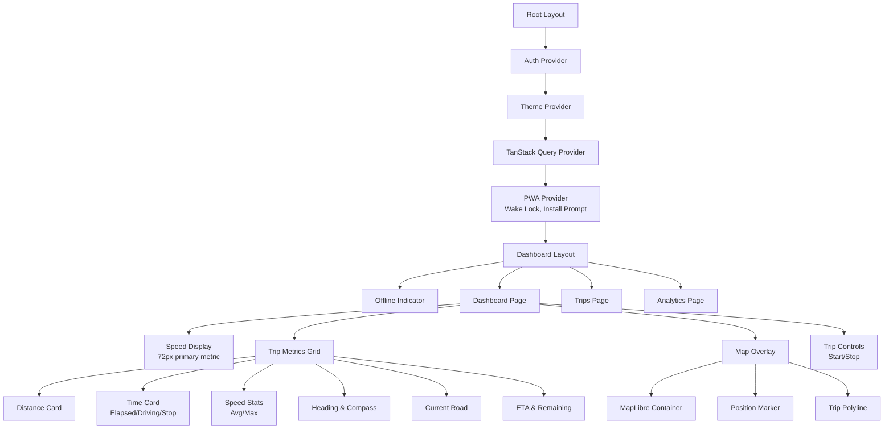

# Design Document: RoadPilot Egypt

## Overview

RoadPilot Egypt is a Progressive Web Application (PWA) built as a mobile-first advanced driving dashboard combining real-time GPS speed monitoring, trip analytics, and navigation context for long-distance drivers in Egypt. The system operates reliably in offline/low-connectivity environments through an offline-first architecture with background synchronization.

### Key Design Decisions

1. **Offline-First Architecture**: All core functionality (GPS tracking, trip recording, speed display) operates entirely client-side. The server is used only for persistence, authentication, and cross-device sync.
2. **Feature-Based Module Architecture**: Each domain feature (GPS, Trip, Analytics, Map, Auth) is self-contained with its own components, hooks, stores, types, and API routes.
3. **Clean Architecture Layers**: Within each module — presentation (React components), domain (pure business logic), and infrastructure (IndexedDB, API calls, Service Worker).
4. **Event-Driven GPS Pipeline**: GPS positions flow through a pipeline: acquisition → validation → enrichment → state update → UI render, with each stage decoupled.
5. **Dual Storage Strategy**: IndexedDB for local trip persistence and offline operation; PostgreSQL (Neon) for server-side backup and cross-device access.

### Technology Stack

| Layer | Technology | Rationale |
|-------|-----------|-----------|
| Framework | Next.js 14+ (App Router) | SSR for initial load, client-side for dashboard |
| Language | TypeScript (strict) | Type safety across entire codebase |
| Database (Server) | PostgreSQL (Neon) | Serverless Postgres, scales to zero |
| ORM | Drizzle ORM | Type-safe SQL, lightweight, edge-compatible |
| Database (Client) | IndexedDB (via idb) | Structured offline storage |
| Auth | Better Auth | Self-hosted auth, OAuth support |
| Maps | MapLibre GL JS | Open-source, offline-capable map rendering |
| Geocoding | Nominatim | Free reverse geocoding |
| Routing | OpenRouteService | Free routing with driving profiles |
| State (Client) | Zustand | Lightweight, no boilerplate |
| Server State | TanStack Query | Caching, background sync, optimistic updates |
| Validation | Zod | Runtime schema validation |
| Styling | Tailwind CSS + shadcn/ui | Utility-first CSS, accessible components |
| Animation | Framer Motion | Performant React animations |
| Charts | Recharts | Composable chart components |
| Deployment | Vercel + Neon | Edge functions, serverless Postgres |

---

## Architecture

### System Architecture Diagram



### Data Flow: GPS Position Pipeline



### Offline/Online State Machine



---

## Components and Interfaces

### Feature Module Structure

```
src/
├── app/                          # Next.js App Router
│   ├── (auth)/                   # Auth route group
│   │   ├── login/page.tsx
│   │   ├── register/page.tsx
│   │   └── layout.tsx
│   ├── (dashboard)/              # Protected dashboard group
│   │   ├── page.tsx              # Main dashboard
│   │   ├── trips/page.tsx        # Trip history
│   │   ├── trips/[id]/page.tsx   # Trip detail/summary
│   │   ├── analytics/page.tsx    # Analytics screen
│   │   └── layout.tsx
│   ├── api/                      # API routes
│   │   ├── auth/[...all]/route.ts
│   │   ├── trips/route.ts
│   │   ├── trips/[id]/route.ts
│   │   └── sync/route.ts
│   ├── layout.tsx                # Root layout
│   ├── manifest.ts               # Web App Manifest
│   └── sw.ts                     # Service Worker registration
├── features/
│   ├── gps/
│   │   ├── domain/
│   │   │   ├── gps-service.ts          # GPS acquisition & validation
│   │   │   ├── gps-types.ts            # Position, Speed, Heading types
│   │   │   ├── gps-validator.ts        # Zod schemas
│   │   │   └── haversine.ts            # Distance calculation
│   │   ├── infrastructure/
│   │   │   └── geolocation-adapter.ts  # Browser Geolocation API wrapper
│   │   └── presentation/
│   │       ├── hooks/
│   │       │   └── use-gps.ts          # GPS state hook
│   │       └── components/
│   │           ├── speed-display.tsx
│   │           ├── coordinates-display.tsx
│   │           └── compass.tsx
│   ├── trip/
│   │   ├── domain/
│   │   │   ├── trip-engine.ts          # Core trip calculations
│   │   │   ├── trip-types.ts           # Trip, StopEvent types
│   │   │   ├── stop-detector.ts        # Stop/driving classification
│   │   │   ├── speed-calculator.ts     # Avg/max speed logic
│   │   │   └── trip-validator.ts       # Trip record Zod schemas
│   │   ├── infrastructure/
│   │   │   ├── trip-repository.ts      # IndexedDB persistence
│   │   │   └── trip-api.ts             # Server API calls
│   │   └── presentation/
│   │       ├── hooks/
│   │       │   ├── use-trip.ts
│   │       │   └── use-trip-history.ts
│   │       └── components/
│   │           ├── trip-controls.tsx
│   │           ├── trip-metrics.tsx
│   │           ├── trip-timer.tsx
│   │           └── trip-summary.tsx
│   ├── analytics/
│   │   ├── domain/
│   │   │   ├── analytics-engine.ts     # Aggregation logic
│   │   │   ├── analytics-types.ts
│   │   │   └── route-clustering.ts     # Frequent route detection
│   │   ├── infrastructure/
│   │   │   └── analytics-repository.ts
│   │   └── presentation/
│   │       ├── hooks/
│   │       │   └── use-analytics.ts
│   │       └── components/
│   │           ├── analytics-dashboard.tsx
│   │           ├── speed-chart.tsx
│   │           └── distance-chart.tsx
│   ├── map/
│   │   ├── domain/
│   │   │   ├── map-types.ts
│   │   │   ├── polyline-reducer.ts     # Point reduction algorithm
│   │   │   └── tile-cache-strategy.ts
│   │   ├── infrastructure/
│   │   │   ├── map-tile-cache.ts       # Tile caching logic
│   │   │   └── route-api.ts           # OpenRouteService client
│   │   └── presentation/
│   │       ├── hooks/
│   │       │   └── use-map.ts
│   │       └── components/
│   │           ├── map-container.tsx
│   │           ├── trip-polyline.tsx
│   │           └── position-marker.tsx
│   ├── geocoding/
│   │   ├── domain/
│   │   │   ├── geocoder-types.ts
│   │   │   └── throttle-controller.ts  # 3-second throttle
│   │   ├── infrastructure/
│   │   │   ├── nominatim-client.ts
│   │   │   └── geocode-cache.ts        # LRU cache
│   │   └── presentation/
│   │       ├── hooks/
│   │       │   └── use-road-name.ts
│   │       └── components/
│   │           └── road-name-display.tsx
│   ├── auth/
│   │   ├── domain/
│   │   │   ├── auth-types.ts
│   │   │   └── auth-validator.ts       # Registration/login schemas
│   │   ├── infrastructure/
│   │   │   ├── auth-client.ts          # Better Auth client
│   │   │   └── session-manager.ts
│   │   └── presentation/
│   │       ├── hooks/
│   │       │   └── use-auth.ts
│   │       └── components/
│   │           ├── login-form.tsx
│   │           ├── register-form.tsx
│   │           └── auth-guard.tsx
│   ├── sync/
│   │   ├── domain/
│   │   │   ├── sync-types.ts
│   │   │   ├── sync-engine.ts          # Sync orchestration
│   │   │   └── conflict-resolver.ts    # Last-write-wins
│   │   ├── infrastructure/
│   │   │   ├── sync-queue.ts           # Pending sync queue
│   │   │   └── connectivity-monitor.ts # Online/offline detection
│   │   └── presentation/
│   │       ├── hooks/
│   │       │   └── use-sync-status.ts
│   │       └── components/
│   │           └── sync-indicator.tsx
│   └── pwa/
│       ├── domain/
│       │   ├── pwa-types.ts
│       │   └── install-prompt.ts       # Install logic
│       ├── infrastructure/
│       │   ├── service-worker.ts       # SW registration
│       │   └── wake-lock.ts           # Screen Wake Lock
│       └── presentation/
│           ├── hooks/
│           │   ├── use-install-prompt.ts
│           │   └── use-wake-lock.ts
│           └── components/
│               ├── install-banner.tsx
│               ├── offline-indicator.tsx
│               └── ios-install-guide.tsx
├── shared/
│   ├── types/
│   │   └── index.ts                    # Shared type definitions
│   ├── utils/
│   │   ├── format.ts                   # Number/time formatting
│   │   ├── storage.ts                  # Storage quota utilities
│   │   └── date.ts                     # Date/time helpers
│   ├── ui/
│   │   ├── button.tsx                  # shadcn/ui wrappers
│   │   ├── card.tsx
│   │   ├── input.tsx
│   │   └── toast.tsx
│   └── hooks/
│       ├── use-local-storage.ts
│       └── use-reduced-motion.ts
├── lib/
│   ├── db/
│   │   ├── schema.ts                   # Drizzle ORM schema
│   │   ├── migrations/
│   │   └── index.ts                    # DB connection
│   ├── auth/
│   │   └── index.ts                    # Better Auth server config
│   └── idb/
│       ├── schema.ts                   # IndexedDB schema definition
│       └── index.ts                    # IDB connection helper
└── public/
    ├── sw.js                           # Compiled Service Worker
    ├── icons/
    │   ├── icon-192x192.png
    │   ├── icon-512x512.png
    │   └── icon-maskable.png
    └── tiles/                          # Cached map tiles directory
```

### Core Interfaces

```typescript
// features/gps/domain/gps-types.ts
interface GPSPosition {
  latitude: number;           // -90 to 90
  longitude: number;          // -180 to 180
  speed: number | null;       // m/s from Geolocation API
  heading: number | null;     // 0-360 degrees
  accuracy: number;           // meters
  altitude: number | null;    // meters
  timestamp: number;          // Unix epoch ms
}

interface ValidatedPosition {
  latitude: number;
  longitude: number;
  speedKmh: number;           // Converted & validated
  heading: number | null;
  accuracy: number;
  timestamp: number;
}

interface GPSServiceState {
  currentPosition: ValidatedPosition | null;
  lastValidPosition: ValidatedPosition | null;
  signalStatus: 'acquiring' | 'active' | 'lost' | 'denied';
  consecutiveFailures: number;
}

// features/trip/domain/trip-types.ts
interface TripState {
  id: string;
  status: 'idle' | 'active' | 'paused' | 'completed';
  startTimestamp: number;
  endTimestamp: number | null;
  totalDistanceKm: number;
  drivingTimeMs: number;
  stopTimeMs: number;
  averageSpeedKmh: number;
  maxSpeedKmh: number;
  maxSpeedTimestamp: number | null;
  maxSpeedCoordinates: { lat: number; lng: number } | null;
  currentSpeedKmh: number;
  gpsTrace: GPSTracePoint[];
  stopEvents: StopEvent[];
  destination: Destination | null;
  remainingDistanceKm: number | null;
  etaTimestamp: number | null;
}

interface GPSTracePoint {
  lat: number;
  lng: number;
  speedKmh: number;
  timestamp: number;
}

interface StopEvent {
  startTimestamp: number;
  durationMs: number;
  coordinates: { lat: number; lng: number };
}

interface Destination {
  lat: number;
  lng: number;
  name: string;
}

// features/trip/domain/trip-engine.ts
interface TripEngine {
  startTrip(): TripState;
  endTrip(state: TripState): CompletedTrip;
  processPosition(state: TripState, position: ValidatedPosition): TripState;
  calculateAverageSpeed(distanceKm: number, drivingTimeMs: number): number;
  calculateETA(remainingKm: number, avgSpeedKmh: number): number | null;
}

// features/sync/domain/sync-types.ts
interface SyncRecord {
  id: string;
  tripId: string;
  status: 'pending' | 'syncing' | 'synced' | 'sync_failed';
  lastAttempt: number | null;
  retryCount: number;
  data: CompletedTrip;
}

interface SyncConfig {
  maxBatchSize: number;       // 10
  maxRetries: number;         // 10
  initialBackoffMs: number;   // 5000
  maxBackoffMs: number;       // 300000
  stableConnectionMs: number; // 5000
}
```

---

## Data Models

### PostgreSQL Schema (Drizzle ORM)

```typescript
// lib/db/schema.ts
import { pgTable, text, timestamp, doublePrecision, 
         integer, json, boolean, uuid, index } from 'drizzle-orm/pg-core';

export const users = pgTable('users', {
  id: uuid('id').primaryKey().defaultRandom(),
  email: text('email').notNull().unique(),
  displayName: text('display_name').notNull(),
  passwordHash: text('password_hash'),
  googleId: text('google_id').unique(),
  createdAt: timestamp('created_at').defaultNow().notNull(),
  updatedAt: timestamp('updated_at').defaultNow().notNull(),
});

export const sessions = pgTable('sessions', {
  id: text('id').primaryKey(),
  userId: uuid('user_id').notNull().references(() => users.id, { onDelete: 'cascade' }),
  expiresAt: timestamp('expires_at').notNull(),
  createdAt: timestamp('created_at').defaultNow().notNull(),
});

export const trips = pgTable('trips', {
  id: uuid('id').primaryKey().defaultRandom(),
  userId: uuid('user_id').notNull().references(() => users.id, { onDelete: 'cascade' }),
  startTimestamp: timestamp('start_timestamp').notNull(),
  endTimestamp: timestamp('end_timestamp').notNull(),
  totalDistanceKm: doublePrecision('total_distance_km').notNull(),
  drivingTimeMs: integer('driving_time_ms').notNull(),
  stopTimeMs: integer('stop_time_ms').notNull(),
  averageSpeedKmh: doublePrecision('average_speed_kmh').notNull(),
  maxSpeedKmh: doublePrecision('max_speed_kmh').notNull(),
  maxSpeedTimestamp: timestamp('max_speed_timestamp'),
  maxSpeedLat: doublePrecision('max_speed_lat'),
  maxSpeedLng: doublePrecision('max_speed_lng'),
  startLocationName: text('start_location_name'),
  endLocationName: text('end_location_name'),
  startLat: doublePrecision('start_lat').notNull(),
  startLng: doublePrecision('start_lng').notNull(),
  endLat: doublePrecision('end_lat').notNull(),
  endLng: doublePrecision('end_lng').notNull(),
  gpsTrace: json('gps_trace').$type<GPSTracePoint[]>().notNull(),
  stopEvents: json('stop_events').$type<StopEvent[]>().notNull(),
  numberOfStops: integer('number_of_stops').notNull(),
  syncedAt: timestamp('synced_at').defaultNow().notNull(),
  clientUpdatedAt: timestamp('client_updated_at').notNull(),
  createdAt: timestamp('created_at').defaultNow().notNull(),
}, (table) => ({
  userIdIdx: index('trips_user_id_idx').on(table.userId),
  startTimestampIdx: index('trips_start_timestamp_idx').on(table.startTimestamp),
  userStartIdx: index('trips_user_start_idx').on(table.userId, table.startTimestamp),
}));

export const tripAnalytics = pgTable('trip_analytics', {
  id: uuid('id').primaryKey().defaultRandom(),
  userId: uuid('user_id').notNull().references(() => users.id, { onDelete: 'cascade' }),
  periodType: text('period_type').notNull(), // 'weekly' | 'monthly'
  periodStart: timestamp('period_start').notNull(),
  periodEnd: timestamp('period_end').notNull(),
  totalDistanceKm: doublePrecision('total_distance_km').notNull(),
  totalDrivingTimeMs: integer('total_driving_time_ms').notNull(),
  totalStopTimeMs: integer('total_stop_time_ms').notNull(),
  averageTripSpeedKmh: doublePrecision('average_trip_speed_kmh').notNull(),
  numberOfTrips: integer('number_of_trips').notNull(),
  computedAt: timestamp('computed_at').defaultNow().notNull(),
}, (table) => ({
  userPeriodIdx: index('analytics_user_period_idx').on(table.userId, table.periodType, table.periodStart),
}));
```

### IndexedDB Schema

```typescript
// lib/idb/schema.ts
import { openDB, DBSchema } from 'idb';

interface RoadPilotDB extends DBSchema {
  trips: {
    key: string; // trip ID
    value: {
      id: string;
      status: 'active' | 'completed';
      startTimestamp: number;
      endTimestamp: number | null;
      totalDistanceKm: number;
      drivingTimeMs: number;
      stopTimeMs: number;
      averageSpeedKmh: number;
      maxSpeedKmh: number;
      maxSpeedTimestamp: number | null;
      maxSpeedCoordinates: { lat: number; lng: number } | null;
      startLocationName: string | null;
      endLocationName: string | null;
      startCoordinates: { lat: number; lng: number };
      endCoordinates: { lat: number; lng: number } | null;
      gpsTrace: GPSTracePoint[];
      stopEvents: StopEvent[];
      numberOfStops: number;
      syncStatus: 'pending' | 'syncing' | 'synced' | 'sync_failed';
      lastSyncAttempt: number | null;
      retryCount: number;
      updatedAt: number;
    };
    indexes: {
      'by-status': string;
      'by-start-date': number;
      'by-sync-status': string;
      'by-distance': number;
    };
  };
  activeTrip: {
    key: 'current';
    value: {
      tripId: string;
      startTimestamp: number;
      totalDistanceKm: number;
      drivingTimeMs: number;
      stopTimeMs: number;
      maxSpeedKmh: number;
      maxSpeedTimestamp: number | null;
      maxSpeedCoordinates: { lat: number; lng: number } | null;
      lastPosition: ValidatedPosition | null;
      gpsTrace: GPSTracePoint[];
      stopEvents: StopEvent[];
      lastCheckpoint: number; // timestamp of last persistence
    };
  };
  geocodeCache: {
    key: string; // geohash of coordinates
    value: {
      roadName: string | null;
      localityName: string | null;
      timestamp: number;
      coordinates: { lat: number; lng: number };
    };
    indexes: {
      'by-timestamp': number;
    };
  };
  settings: {
    key: string;
    value: {
      key: string;
      value: unknown;
      updatedAt: number;
    };
  };
}

export async function getDB() {
  return openDB<RoadPilotDB>('roadpilot-egypt', 1, {
    upgrade(db) {
      const tripStore = db.createObjectStore('trips', { keyPath: 'id' });
      tripStore.createIndex('by-status', 'status');
      tripStore.createIndex('by-start-date', 'startTimestamp');
      tripStore.createIndex('by-sync-status', 'syncStatus');
      tripStore.createIndex('by-distance', 'totalDistanceKm');

      db.createObjectStore('activeTrip');
      
      const geocodeStore = db.createObjectStore('geocodeCache', { keyPath: 'coordinates' });
      geocodeStore.createIndex('by-timestamp', 'timestamp');
      
      db.createObjectStore('settings', { keyPath: 'key' });
    },
  });
}
```

### Zustand Stores

```typescript
// features/gps/presentation/hooks/use-gps-store.ts
interface GPSStore {
  position: ValidatedPosition | null;
  lastValidPosition: ValidatedPosition | null;
  signalStatus: 'acquiring' | 'active' | 'lost' | 'denied';
  consecutiveFailures: number;
  
  setPosition: (pos: ValidatedPosition) => void;
  setSignalLost: () => void;
  setSignalDenied: () => void;
  reset: () => void;
}

// features/trip/presentation/hooks/use-trip-store.ts
interface TripStore {
  tripState: TripState | null;
  isActive: boolean;
  
  startTrip: () => void;
  endTrip: () => void;
  updateFromPosition: (position: ValidatedPosition) => void;
  setDestination: (dest: Destination) => void;
  clearDestination: () => void;
  restoreTrip: (state: TripState) => void;
}

// features/sync/presentation/hooks/use-sync-store.ts
interface SyncStore {
  isOnline: boolean;
  isSyncing: boolean;
  pendingCount: number;
  lastSyncTimestamp: number | null;
  
  setOnline: (online: boolean) => void;
  setSyncing: (syncing: boolean) => void;
  updatePendingCount: (count: number) => void;
  setLastSync: (timestamp: number) => void;
}

// features/pwa/presentation/hooks/use-ui-store.ts
interface UIStore {
  theme: 'dark' | 'light';
  language: 'en' | 'ar';
  mapExpanded: boolean;
  reducedMotion: boolean;
  
  toggleTheme: () => void;
  setLanguage: (lang: 'en' | 'ar') => void;
  toggleMap: () => void;
  setReducedMotion: (reduced: boolean) => void;
}
```

---

## API Design

### Next.js API Routes

#### Trip Sync API

```
POST /api/sync
```
Synchronizes a batch of trip records from client to server.

**Request Body (validated by Zod):**
```typescript
{
  trips: Array<{
    id: string;
    startTimestamp: string;       // ISO 8601
    endTimestamp: string;         // ISO 8601
    totalDistanceKm: number;
    drivingTimeMs: number;
    stopTimeMs: number;
    averageSpeedKmh: number;
    maxSpeedKmh: number;
    maxSpeedTimestamp: string | null;
    maxSpeedLat: number | null;
    maxSpeedLng: number | null;
    startLocationName: string | null;
    endLocationName: string | null;
    startLat: number;
    startLng: number;
    endLat: number;
    endLng: number;
    gpsTrace: GPSTracePoint[];
    stopEvents: StopEvent[];
    numberOfStops: number;
    clientUpdatedAt: string;     // ISO 8601
  }>;
}
```

**Response:**
```typescript
// 200 OK
{
  synced: string[];             // IDs successfully synced
  conflicts: Array<{
    id: string;
    resolution: 'client_wins' | 'server_wins';
  }>;
  failed: Array<{
    id: string;
    error: string;
  }>;
}

// 422 Validation Error
{
  errors: Array<{
    path: string;
    message: string;
  }>;
}
```

#### Trip CRUD API

```
GET /api/trips?page=1&limit=20&from=2024-01-01&to=2024-12-31
GET /api/trips/:id
DELETE /api/trips/:id
```

#### Analytics API

```
GET /api/analytics?period=weekly&from=2024-01-01&to=2024-03-31
GET /api/analytics/routes?minTrips=3
```

#### Auth API (Better Auth)

```
POST /api/auth/sign-up           # Email/password registration
POST /api/auth/sign-in           # Email/password login  
POST /api/auth/sign-in/social    # OAuth (Google)
POST /api/auth/sign-out          # Logout
GET  /api/auth/session           # Get current session
```

### Rate Limiting

Implemented via middleware:
- Authenticated: 100 requests/minute per user
- Unauthenticated: 20 requests/minute per IP
- Response: 429 with `Retry-After` header

---

## Client-Side Architecture

### GPS Service

The GPS Service wraps the browser's Geolocation API and provides a validated, normalized stream of position data.

```typescript
// Core algorithm: GPS acquisition and validation pipeline
class GPSServiceImpl {
  private watchId: number | null = null;
  private lastPosition: ValidatedPosition | null = null;
  private consecutiveFailures = 0;
  
  start(onPosition: (pos: ValidatedPosition) => void, onError: (err: GPSError) => void) {
    this.watchId = navigator.geolocation.watchPosition(
      (geoPosition) => {
        const raw = this.extractRawPosition(geoPosition);
        const validation = gpsPositionSchema.safeParse(raw);
        
        if (!validation.success) {
          // Discard invalid, keep last valid
          return;
        }
        
        const validated = this.normalize(validation.data);
        this.consecutiveFailures = 0;
        this.lastPosition = validated;
        onPosition(validated);
      },
      (error) => {
        this.consecutiveFailures++;
        if (this.consecutiveFailures >= 3) {
          onError({ type: 'signal_lost', lastValid: this.lastPosition });
        }
      },
      {
        enableHighAccuracy: true,
        maximumAge: 1000,
        timeout: 5000,
      }
    );
  }
}
```

### Trip Engine — Key Algorithms

#### Haversine Distance Calculation

```typescript
// features/gps/domain/haversine.ts
export function haversineDistanceKm(
  lat1: number, lon1: number,
  lat2: number, lon2: number
): number {
  const R = 6371; // Earth's radius in km
  const dLat = toRadians(lat2 - lat1);
  const dLon = toRadians(lon2 - lon1);
  
  const a = Math.sin(dLat / 2) * Math.sin(dLat / 2) +
            Math.cos(toRadians(lat1)) * Math.cos(toRadians(lat2)) *
            Math.sin(dLon / 2) * Math.sin(dLon / 2);
  
  const c = 2 * Math.atan2(Math.sqrt(a), Math.sqrt(1 - a));
  return R * c;
}

function toRadians(degrees: number): number {
  return degrees * (Math.PI / 180);
}
```

#### Speed Calculation (Fallback)

```typescript
// When GPS speed is null, calculate from position delta
export function calculateSpeedKmh(
  prev: ValidatedPosition,
  curr: ValidatedPosition
): number {
  const distanceKm = haversineDistanceKm(
    prev.latitude, prev.longitude,
    curr.latitude, curr.longitude
  );
  const timeHours = (curr.timestamp - prev.timestamp) / 3_600_000;
  
  if (timeHours <= 0) return 0;
  return distanceKm / timeHours;
}
```

#### Stop Detection State Machine

```typescript
// features/trip/domain/stop-detector.ts
type MovementState = 'driving' | 'maybe_stopped' | 'stopped';

interface StopDetectorState {
  movementState: MovementState;
  stateEnteredAt: number;
  gracePeriodMs: number;      // 30,000 ms
  speedThresholdKmh: number;  // 2 km/h
}

export function processSpeedReading(
  state: StopDetectorState,
  speedKmh: number,
  timestamp: number
): { newState: StopDetectorState; event: StopDetectorEvent | null } {
  const belowThreshold = speedKmh < state.speedThresholdKmh;
  
  switch (state.movementState) {
    case 'driving':
      if (belowThreshold) {
        return {
          newState: { ...state, movementState: 'maybe_stopped', stateEnteredAt: timestamp },
          event: null, // Still classified as driving during grace period
        };
      }
      return { newState: state, event: null };
      
    case 'maybe_stopped':
      if (!belowThreshold) {
        // Speed picked up — was just a brief slowdown
        return {
          newState: { ...state, movementState: 'driving', stateEnteredAt: timestamp },
          event: null,
        };
      }
      if (timestamp - state.stateEnteredAt >= state.gracePeriodMs) {
        // Confirmed stop — retroactively mark grace period as stop time
        return {
          newState: { ...state, movementState: 'stopped', stateEnteredAt: state.stateEnteredAt },
          event: { type: 'stop_confirmed', retroactiveMs: state.gracePeriodMs },
        };
      }
      return { newState: state, event: null };
      
    case 'stopped':
      if (!belowThreshold) {
        return {
          newState: { ...state, movementState: 'driving', stateEnteredAt: timestamp },
          event: { type: 'stop_ended', durationMs: timestamp - state.stateEnteredAt },
        };
      }
      return { newState: state, event: null };
  }
}
```

#### Heading Calculation

```typescript
// Calculate bearing between two coordinates
export function calculateBearing(
  lat1: number, lon1: number,
  lat2: number, lon2: number
): number {
  const dLon = toRadians(lon2 - lon1);
  const y = Math.sin(dLon) * Math.cos(toRadians(lat2));
  const x = Math.cos(toRadians(lat1)) * Math.sin(toRadians(lat2)) -
            Math.sin(toRadians(lat1)) * Math.cos(toRadians(lat2)) * Math.cos(dLon);
  
  const bearing = Math.atan2(y, x);
  return (toDegrees(bearing) + 360) % 360;
}

// Convert heading degrees to cardinal direction
export function headingToCardinal(degrees: number): string {
  const directions = ['N', 'NE', 'E', 'SE', 'S', 'SW', 'W', 'NW'];
  // Offset by 22.5 so N covers 338-22
  const index = Math.round(((degrees + 22.5) % 360) / 45) % 8;
  return directions[index];
}
```

### Offline/Sync Strategy

#### Service Worker Architecture



**Caching Strategies:**

| Resource Type | Strategy | TTL | Max Size |
|--------------|----------|-----|----------|
| App Shell (HTML, CSS, JS) | Cache-First | Until SW update | — |
| API Responses | Network-First (5s timeout) | Response-dependent | 50MB |
| Map Tiles | Cache-First + Background Refresh | 30 days | 200MB |
| Fonts & Icons | Cache-First | Until SW update | — |

#### Sync Engine

```typescript
// Exponential backoff with jitter
function calculateBackoff(retryCount: number, config: SyncConfig): number {
  const base = config.initialBackoffMs * Math.pow(2, retryCount);
  const capped = Math.min(base, config.maxBackoffMs);
  const jitter = capped * (0.5 + Math.random() * 0.5);
  return jitter;
}

// Sync orchestration flow
async function syncPendingTrips(config: SyncConfig): Promise<SyncResult> {
  const pending = await getPendingSyncRecords(config.maxBatchSize);
  
  if (pending.length === 0) return { synced: [], failed: [] };
  
  try {
    const response = await fetch('/api/sync', {
      method: 'POST',
      body: JSON.stringify({ trips: pending.map(r => r.data) }),
    });
    
    if (response.ok) {
      const result = await response.json();
      await markSynced(result.synced);
      return result;
    }
    
    if (response.status === 422) {
      // Validation error — mark as failed, don't retry
      await markFailed(pending.map(r => r.id));
    }
  } catch (error) {
    // Network error — will retry with backoff
    await incrementRetryCount(pending);
  }
}
```

#### Conflict Resolution

Last-write-wins based on `clientUpdatedAt` timestamp:
1. Client sends trip with `clientUpdatedAt`
2. Server checks if trip ID exists
3. If exists and server's `clientUpdatedAt` > client's → server wins (reject client update)
4. If exists and client's `clientUpdatedAt` >= server's → client wins (overwrite)
5. If not exists → insert new record

### Authentication Flow



### State Management Pattern



**Pattern Rules:**
- Zustand stores hold real-time, frequently-updating state (GPS position, active trip metrics)
- TanStack Query manages server-derived state (trip history, analytics, auth session)
- IndexedDB is the source of truth for trip data; Zustand reflects the active subset
- Stores are composed (Trip Store subscribes to GPS Store updates)

---

## Component Hierarchy



---


## Correctness Properties

*A property is a characteristic or behavior that should hold true across all valid executions of a system — essentially, a formal statement about what the system should do. Properties serve as the bridge between human-readable specifications and machine-verifiable correctness guarantees.*

### Property 1: Speed Conversion and Display

*For any* GPS speed value in meters-per-second (≥ 0), converting to km/h by multiplying by 3.6 SHALL produce the correct value, AND *for any* converted speed below 2 km/h, the display SHALL output "0.0", AND *for any* null speed with two valid positions and a positive time delta, the fallback calculation (Haversine distance / time) SHALL produce a non-negative speed value.

**Validates: Requirements 1.2, 1.4, 1.7**

### Property 2: Geocoder Throttle Control

*For any* sequence of GPS position updates with arbitrary timestamps, the throttle controller SHALL ensure that actual outbound Nominatim requests are separated by at least 3 seconds, and intermediate positions are discarded without queuing.

**Validates: Requirements 2.1, 2.5**

### Property 3: Road Name Truncation

*For any* road name string, if the string length exceeds 60 characters, the displayed value SHALL be the first 60 characters followed by an ellipsis ("…"), and if the string length is 60 or fewer characters, the displayed value SHALL be the original string unchanged.

**Validates: Requirements 2.2**

### Property 4: Bilingual Name Selection

*For any* geocoding result containing both an Arabic name and an English name, and *for any* user language preference (Arabic or English), the system SHALL return the name matching the user's selected language.

**Validates: Requirements 2.7**

### Property 5: Coordinate Formatting

*For any* valid latitude in [-90, 90] and longitude in [-180, 180], the formatting function SHALL produce a string with exactly six decimal places for each coordinate value, and the numeric value parsed from the formatted string SHALL be within 0.0000005 of the original value.

**Validates: Requirements 3.1**

### Property 6: Heading Calculation and Cardinal Direction

*For any* two GPS coordinates separated by at least 5 meters, the bearing calculation SHALL produce a value in [0, 360), AND *for any* heading value in [0, 360), the cardinal direction mapping SHALL assign exactly one of the eight directions (N, NE, E, SE, S, SW, W, NW) following the 45-degree segment boundaries: N (338–22), NE (23–67), E (68–112), SE (113–157), S (158–202), SW (203–247), W (248–292), NW (293–337).

**Validates: Requirements 4.1, 4.3**

### Property 7: Shortest Rotational Path

*For any* pair of heading values (from, to) in [0, 360), the rotation direction chosen SHALL be the shortest angular path, meaning the absolute angular difference of the chosen rotation SHALL be ≤ 180 degrees.

**Validates: Requirements 4.2**

### Property 8: Haversine Distance Accumulation

*For any* sequence of valid GPS positions (with accuracy ≤ 50 meters), the cumulative trip distance SHALL equal the sum of individual Haversine segments between consecutive positions, AND positions with accuracy > 50 meters SHALL contribute zero distance to the total.

**Validates: Requirements 5.1, 5.2**

### Property 9: Recalculation Trigger Logic

*For any* sequence of (timestamp, distanceDelta) events during an active trip with a destination, the route recalculation SHALL trigger when either 2 minutes have elapsed since the last calculation OR 5 kilometers of cumulative travel have occurred since the last calculation, whichever comes first, and SHALL NOT trigger more frequently than these thresholds.

**Validates: Requirements 6.3**

### Property 10: Route Deviation Detection

*For any* current GPS position and last calculated route polyline, the deviation detection SHALL trigger a recalculation if and only if the minimum Haversine distance from the current position to any segment of the route exceeds 1 kilometer.

**Validates: Requirements 6.7**

### Property 11: Time Formatting (HH:MM:SS)

*For any* non-negative duration in milliseconds (from 0 to 359,999,000 inclusive, representing up to 99:59:59), the formatting function SHALL produce a string in the format HH:MM:SS where hours are zero-padded to at least 2 digits, minutes are 00–59, and seconds are 00–59, AND parsing the formatted string back to milliseconds SHALL equal the original value rounded to the nearest second.

**Validates: Requirements 7.2, 8.4**

### Property 12: Stop Detection State Machine Invariant

*For any* sequence of speed readings with timestamps during an active trip, the sum of Driving_Time and Stop_Time SHALL equal the total elapsed time (excluding any GPS-signal-lost pauses), AND *for any* continuous period of speed < 2 km/h lasting ≥ 30 seconds, the entire period (including the initial 30-second grace period) SHALL be classified as Stop_Time, AND *for any* continuous period of speed < 2 km/h lasting < 30 seconds followed by speed ≥ 2 km/h, those seconds SHALL be classified as Driving_Time.

**Validates: Requirements 8.1, 8.2, 8.3**

### Property 13: Average Speed Calculation

*For any* total distance (≥ 0 km) and driving time (> 0 ms), the average speed SHALL equal totalDistanceKm / (drivingTimeMs / 3,600,000), capped at a maximum of 999.9 km/h, AND when driving time is zero, the average speed SHALL be 0.0.

**Validates: Requirements 9.1, 9.3, 9.4**

### Property 14: Maximum Speed Tracking

*For any* sequence of GPS speed readings during a trip, the tracked maximum speed SHALL equal the highest speed value from readings where (a) accuracy ≤ 30 meters AND (b) speed ≤ 250 km/h, AND readings that violate either condition SHALL be excluded from the maximum calculation.

**Validates: Requirements 10.2, 10.3, 10.4**

### Property 15: ETA Calculation

*For any* remaining distance (> 0 km), average speed (≥ 5 km/h), and current timestamp, the ETA SHALL equal the current timestamp plus (remainingDistanceKm / averageSpeedKmh) hours converted to milliseconds, AND the formatted display SHALL be a valid HH:MM time in 24-hour format.

**Validates: Requirements 11.1, 11.2**

### Property 16: Sync Batch Size

*For any* number of pending trip records (0 to N), the sync service SHALL process at most 10 records per sync batch, meaning every batch sent to the server contains between 1 and 10 records inclusive (or 0 if no pending records exist).

**Validates: Requirements 12.2**

### Property 17: Conflict Resolution (Last-Write-Wins)

*For any* pair of trip records with the same trip ID but different `clientUpdatedAt` timestamps, the conflict resolver SHALL keep the record with the later (larger) `clientUpdatedAt` value and discard the other.

**Validates: Requirements 12.5**

### Property 18: Trip Summary Generation

*For any* valid completed trip record containing GPS trace, stop events, and timing data, the generated trip summary SHALL contain: total distance equal to the sum of Haversine segments, elapsed time equal to endTimestamp minus startTimestamp, driving time and stop time that sum to elapsed time (minus signal-lost gaps), average speed equal to distance/drivingTime, max speed equal to the maximum valid reading, and number of stops equal to the count of stop events.

**Validates: Requirements 13.1**

### Property 19: GPS Trace Point Reduction

*For any* GPS trace containing more than 500 coordinate points, the point reduction algorithm SHALL produce an output with at most 500 points, AND the first and last points of the original trace SHALL be preserved in the output.

**Validates: Requirements 13.4**

### Property 20: Speed Chart Downsampling

*For any* trip speed time-series data, the downsampled chart data SHALL have a maximum interval of 30 seconds between consecutive data points, and no interval between adjacent points SHALL exceed 30 seconds.

**Validates: Requirements 13.5**

### Property 21: Analytics Aggregation

*For any* set of completed trip records within a given time period, the weekly/monthly aggregates SHALL satisfy: total distance equals the sum of individual trip distances, total driving time equals the sum of individual driving times, total stop time equals the sum of individual stop times, number of trips equals the count of trips in the period, and average trip speed equals total distance divided by total driving time.

**Validates: Requirements 14.1, 14.3**

### Property 22: Route Proximity Clustering

*For any* set of trip start/end coordinate pairs, the clustering algorithm SHALL group trips whose start coordinates are within 500 meters of each other AND whose end coordinates are within 500 meters of each other, and SHALL only return routes where the group contains at least 3 trips.

**Validates: Requirements 14.4**

### Property 23: GPS Position Validation

*For any* input GPS data object, the Zod validation schema SHALL accept if and only if: latitude is in [-90, 90], longitude is in [-180, 180], speed (if present) is in [0, 400] km/h, heading (if present) is in [0, 360], and accuracy is ≥ 0. All other inputs SHALL be rejected.

**Validates: Requirements 20.1**

### Property 24: Trip Record Validation

*For any* trip record object, the Zod validation schema SHALL accept if and only if: trip ID is a non-empty string, start timestamp is not in the future (relative to validation time), total distance is ≥ 0, and driving time is ≥ 0. All other inputs SHALL be rejected.

**Validates: Requirements 20.3, 20.4**

### Property 25: Auth Input Validation

*For any* registration payload, the Zod validation schema SHALL accept if and only if: email matches a valid email format, password length is between 8 and 128 characters inclusive, and display name length is between 1 and 100 characters inclusive. All other inputs SHALL be rejected.

**Validates: Requirements 20.6**

### Property 26: Exponential Backoff Calculation

*For any* retry count n in [0, 10], the calculated backoff delay SHALL be at least `initialDelay * 2^n * 0.5` (with jitter lower bound) and at most `min(initialDelay * 2^n, maxDelay)` (capped at 5 minutes), where initialDelay is 5 seconds.

**Validates: Requirements 22.2**

---

## Error Handling

### Error Categories and Strategies

| Category | Example | Strategy | User Impact |
|----------|---------|----------|-------------|
| GPS Signal Lost | No fix for 3+ attempts | Show indicator, retain last values, auto-resume | Minimal — stale data shown |
| GPS Permission Denied | User rejects permission | Explain need, disable trip features | Blocks core functionality |
| Network Unavailable | Offline on highway | Full offline operation, queue sync | Transparent — offline indicator |
| Storage Full | IndexedDB quota exceeded | Banner notification, recommend sync/cleanup | Prevents new trip save |
| Sync Failure | Server unreachable | Exponential backoff, 10 retries, mark failed | Trips saved locally |
| Validation Error | Invalid GPS data | Discard reading, retain last valid | Invisible to user |
| Route API Error | ORS returns error | Fall back to Haversine estimate | Degraded accuracy shown |
| Auth Failure | Invalid credentials | Generic error message | Security-preserving |
| Wake Lock Denied | API unsupported | Show notification, recommend manual setting | Screen may turn off |
| Crash Recovery | App killed during trip | Restore from IndexedDB checkpoint | Resume within 5s |

### Error Boundary Strategy

```typescript
// Hierarchical error boundaries
// Level 1: Root — catches catastrophic failures, shows recovery UI
// Level 2: Feature — catches feature-level errors, shows feature-specific fallback
// Level 3: Component — catches render errors in individual metric cards

// GPS Error Flow
GPS Position Error → Increment failure counter
  → If counter >= 3 → Set signalStatus = 'lost', show indicator
  → If counter < 3 → Silent retry (Geolocation API continues polling)
  → After 5 minutes without valid fix → Mark trip segment interrupted

// Sync Error Flow  
Sync Request Fails → Calculate backoff delay
  → Wait delay → Retry
  → If retries >= 10 → Mark as 'sync_failed'
  → On next connectivity event → Reset retry count, attempt again

// Validation Error Flow
Invalid Data Received → Zod parse failure
  → Log rejection reason (development builds)
  → Discard invalid data
  → Retain last known valid state
  → Continue operation without interruption
```

### Graceful Degradation Matrix

| Feature | Online | Offline | GPS Lost | Storage Full |
|---------|--------|---------|----------|-------------|
| Speed Display | ✅ Full | ✅ Full | ⚠️ Stale + indicator | ✅ Full |
| Trip Recording | ✅ Full | ✅ Full | ⚠️ Pause distance | ❌ Blocked (banner) |
| Road Name | ✅ Live | ⚠️ Cached + indicator | ⚠️ Cached | ✅ Cached |
| Map Display | ✅ Full | ⚠️ Cached tiles | ✅ Full | ✅ Full |
| Route/ETA | ✅ Full | ⚠️ Haversine estimate | ⚠️ Haversine | ✅ Full |
| Trip History | ✅ Full | ✅ Local only | ✅ Full | ✅ Full |
| Sync | ✅ Active | ❌ Queued | ✅ Full | ✅ Full |
| Analytics | ✅ Full | ✅ Local data | ✅ Full | ✅ Full |

---

## Testing Strategy

### Testing Pyramid

```
         ┌───────────────┐
         │   E2E Tests   │  ← Playwright: critical user journeys
         │   (Few)       │
         ├───────────────┤
         │ Integration   │  ← API routes, IndexedDB operations, Service Worker
         │   Tests       │
         ├───────────────┤
         │  Unit Tests   │  ← Domain layer functions, Zod schemas
         │  (Many)       │
         ├───────────────┤
         │Property Tests │  ← Universal properties (fast-check, 100+ iterations)
         │  (Core)       │
         └───────────────┘
```

### Property-Based Testing Configuration

**Library:** [fast-check](https://github.com/dubzzz/fast-check) (TypeScript property-based testing library)

**Configuration:**
- Minimum 100 iterations per property
- Seed-based reproducibility for CI
- Shrinking enabled for minimal counterexamples

**Tag Format:** Each property test file includes a comment:
```typescript
// Feature: roadpilot-egypt, Property {N}: {property_text}
```

**Property Test Organization:**
```
tests/
├── properties/
│   ├── speed-conversion.property.test.ts    # Property 1
│   ├── throttle-control.property.test.ts    # Property 2
│   ├── road-name-truncation.property.test.ts # Property 3
│   ├── bilingual-selection.property.test.ts # Property 4
│   ├── coordinate-format.property.test.ts   # Property 5
│   ├── heading-cardinal.property.test.ts    # Property 6
│   ├── shortest-rotation.property.test.ts   # Property 7
│   ├── haversine-distance.property.test.ts  # Property 8
│   ├── recalc-trigger.property.test.ts      # Property 9
│   ├── route-deviation.property.test.ts     # Property 10
│   ├── time-formatting.property.test.ts     # Property 11
│   ├── stop-detection.property.test.ts      # Property 12
│   ├── average-speed.property.test.ts       # Property 13
│   ├── max-speed.property.test.ts           # Property 14
│   ├── eta-calculation.property.test.ts     # Property 15
│   ├── sync-batch.property.test.ts          # Property 16
│   ├── conflict-resolution.property.test.ts # Property 17
│   ├── trip-summary.property.test.ts        # Property 18
│   ├── point-reduction.property.test.ts     # Property 19
│   ├── speed-chart-downsample.property.test.ts # Property 20
│   ├── analytics-aggregation.property.test.ts  # Property 21
│   ├── route-clustering.property.test.ts    # Property 22
│   ├── gps-validation.property.test.ts      # Property 23
│   ├── trip-validation.property.test.ts     # Property 24
│   ├── auth-validation.property.test.ts     # Property 25
│   └── exponential-backoff.property.test.ts # Property 26
├── unit/
│   ├── gps-service.test.ts
│   ├── trip-engine.test.ts
│   ├── stop-detector.test.ts
│   ├── sync-engine.test.ts
│   └── analytics-engine.test.ts
├── integration/
│   ├── trip-api.test.ts
│   ├── sync-api.test.ts
│   ├── idb-repository.test.ts
│   └── service-worker.test.ts
└── e2e/
    ├── trip-recording.test.ts
    ├── offline-operation.test.ts
    └── auth-flow.test.ts
```

### Unit Test Focus Areas

- **Edge cases**: GPS signal boundaries, zero-division guards, storage limits
- **State transitions**: Trip start/stop, online/offline, stop detection states
- **Error handling**: Invalid data rejection, retry exhaustion, fallback activation
- **Specific examples**: Known coordinate pairs with expected distances, specific heading-to-cardinal mappings

### Integration Test Focus Areas

- **IndexedDB operations**: CRUD, index queries, storage quota monitoring
- **API routes**: Authentication, trip sync, analytics endpoints
- **Service Worker**: Cache strategies, offline fallback behavior
- **External APIs**: Nominatim and ORS with mocked responses

### Coverage Targets

| Layer | Target | Rationale |
|-------|--------|-----------|
| Domain (business logic) | 80%+ | Core algorithms must be thoroughly tested |
| Infrastructure | 60%+ | Integration points need verification |
| Presentation | 40%+ | Component rendering, hooks behavior |
| API Routes | 70%+ | Request validation, auth, error responses |

### Test Runner Configuration

- **Framework**: Vitest (fast, ESM-native, TypeScript-first)
- **Property Testing**: fast-check (integrated with Vitest)
- **E2E**: Playwright (cross-browser PWA testing)
- **Coverage**: V8 coverage via Vitest
- **CI**: Run all tests on every PR; property tests with fixed seed for reproducibility
